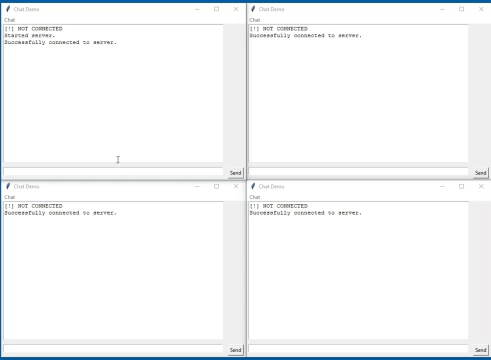

# Another Python Networking Tool (apynt)
Another Python Networking Tool (Apynt) is an easy to use networking utility for integrating a client-server model and 
custom protocols in applications. This project is still underdevelopment, however, building applications is still very
possible with this current build.

Apynt adopts Flask's `@app.route()` decorator syntax style in order to create client/server message receive callbacks.
This tool is designed for ease of use and tries to provide easy integration in existing applications.

## Demos
### Chat application

###Whiteboard application

## TODO
* Add a reliable-UDP send
* Add support for TCP based protocols
* Allow for more data types when defining messages
* Move from threaded approach to asynchronous
